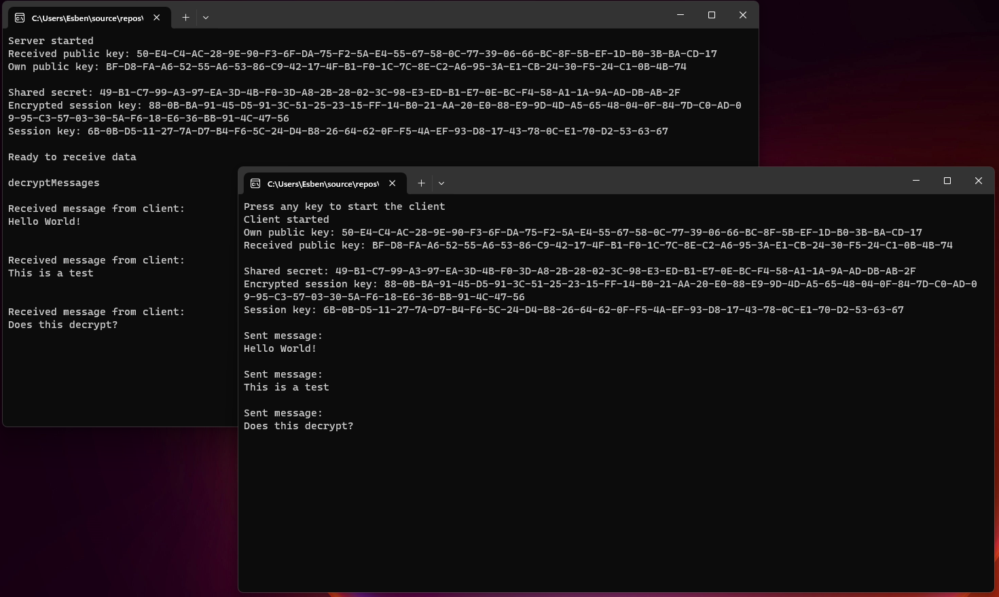

# Crypto assignment

8 cryptography algorithm usage assignments.
#### &  
Server / Client encryption, using Diffie-Hellman key exchange with X25519, AES-CBC for session key encryption/decryption, and AES_GCM encryption/decryption for messages.

